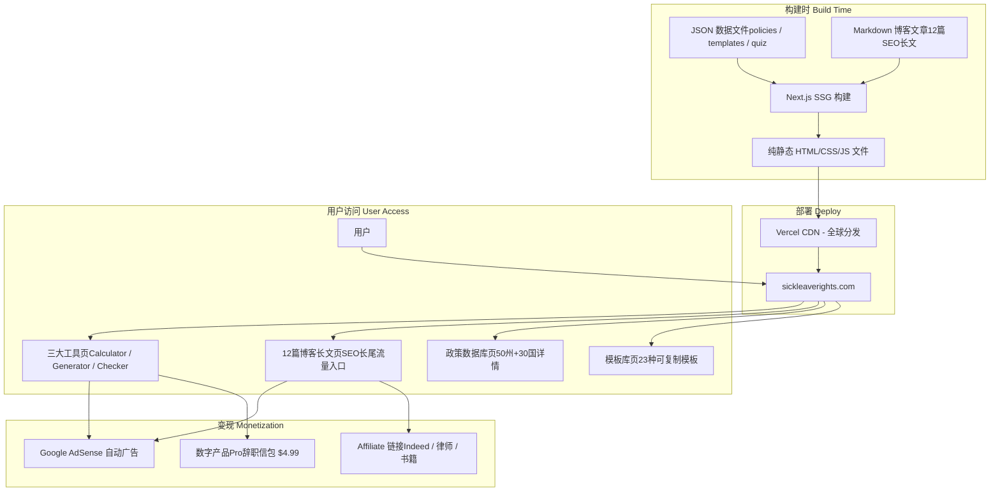

> 最后更新：2026-04-14

## 产品概述

sickleaverights.com 是一个面向全球职场人群（以美国、印度、英国为主）的**职场权益工具箱网站**，采用"做完不管"的被动收入站模式。用户可以查询各国/各州的病假法律权利、一键生成专业辞职信、检测自身劳动权益是否被侵犯。网站依靠长尾SEO获取自然流量，通过 Google AdSense 广告和 Affiliate 链接实现自动变现。

## 核心特性

1. **病假权利计算器（Sick Leave Calculator）** -- 用户选择国家/州后，展示当地法定病假天数、带薪比例、适用条件，以卡片式布局呈现
2. **辞职信生成器（Resignation Letter Generator）** -- 用户填写基本信息和场景（两周通知/立即辞职/专业正式/轻松友好等），纯前端模板引擎生成可复制/下载的辞职信
3. **员工权益检测器（Employee Rights Checker）** -- 用户回答 5-8 个问卷问题，前端决策树匹配判断权益是否被侵犯，输出严重等级+建议行动
4. **SEO 博客文章** -- 12 篇针对高搜索量长青关键词的深度文章（earned leave vs sick leave、can boss deny sick leave 等），纯静态 HTML 页面
5. **病假邮件/辞职信模板库** -- 23 种场景模板（15 种辞职信 + 8 种病假邮件），可直接一键复制使用
6. **各国病假政策数据库** -- 美国 50 州 + 印度 + 英国 + 全球 30 国的法定病假政策详情页

## 关键约束

- **被动收入模式**：做完后零维护或月度检查即可，不追热点
- **长青内容**：只做 10 年后还有人搜的内容
- **零运维成本**：无数据库、无 API 调用费用、无服务器费用
- **项目路径**：所有代码在 `/Users/tianwenbin/Documents/myclaw/sickleaverights/` 下开发

## 变现模型

| 来源 | 操作频率 | 预期收入占比 |
| --- | --- | --- |
| Google AdSense | 全自动 | ~50% |
| Indeed/ZipRecruiter CPA | 静态链接 | ~20% |
| 律师咨询 Affiliate | 静态链接 | ~15% |
| 辞职信 Pro 版数字产品 ($4.99) | 自动交付 | ~15% |

## Tech Stack

| 层级 | 技术选型 | 理由 |
| --- | --- | --- |
| 前端框架 | Next.js 14 (App Router, SSG) | `output: 'export'` 纯静态导出, 组件化高效开发, 内置 SEO |
| UI 样式 | Tailwind CSS 3.4 | 实用优先, 快速原型, 生产级设计系统 |
| 语言 | TypeScript 5 | 类型安全, JSON 数据结构有完整类型定义 |
| 数据存储 | JSON 文件 | 政策数据几年才变一次, 无 DB 运维成本 |
| 部署方案 | Vercel 免费 / Cloudflare Pages | 自动 HTTPS + CDN + 自定义域名绑定, 零运维 |
| SEO 增强 | next-sitemap + Schema.org JSON-LD | sitemap.xml/robots.txt 自动生成, 结构化数据提升排名 |
| 广告 | Google AdSense script 静态嵌入 | 符合 passive income 模式 |
| 分析 | GA4 script 静态嵌入 | 免费额度够用 |

## 架构设计

### 核心架构：Next.js SSG + JSON Data + Vercel CDN

### 为什么选这套技术栈？

**Q: 为什么用 Next.js SSG 而不是纯 HTML？**

- `output: 'export'` 生成的就是纯静态 HTML, 部署成本与手写 HTML 一致
- 但 React 组件化能力让工具页面（表单交互、状态管理）开发效率高 5-10 倍
- 内置 Image 优化、Head 管理、路由系统大幅减少手工代码
- next-sitemap 一键生成 sitemap.xml, SEO 开箱即用

**Q: 为什么用 JSON 不用数据库？**

- 病假政策数据变更频率极低（各国劳动法数年才修订）
- JSON 随代码部署, 零运维成本, 零数据库月费
- 构建 import JSON 注入页面, 服务端渲染零延迟

**Q: 辞职信为什么不用 AI API？**

- AI API 有按次成本, 与"零运维被动收入"矛盾
- 预设 15 种场景模板 + 变量填充覆盖 95% 真实需求
- 纯前端实现, 部署后持续费用 = $0

## 实现注意事项

1. **SEO 为第一优先级**: 每页独立 title/description/OG 标签; 博客用 Article schema; 图片全部 alt 标签
2. **AdSense 合规**: 首屏不堆广告; 文章 >= 1500 字有价值内容; 必须有 privacy + disclaimer 页
3. **性能目标**: Lighthouse Performance >= 95; 首屏加载 < 1.5s

---

## ✅ 已完成（MVP，2026-04-14）

### 页面 & 功能

| 页面 | 路径 | 状态 |
|------|------|------|
| 首页 Hero + 工具卡片（4张） | `/` | ✅ 上线 |
| 辞职信生成器 | `/resignation-letter-generator/` | ✅ 上线 |
| 博客：Can Boss Deny Sick Leave | `/blog/can-boss-deny-sick-leave/` | ✅ 上线 |
| 博客：Earned Leave vs Sick Leave | `/blog/earned-leave-vs-sick-leave/` | ✅ 上线 |
| 博客：Can Boss Force Earned Leave（热点） | `/blog/can-boss-force-earned-leave/` | ✅ 上线 |
| 隐私政策 | `/privacy/` | ✅ 上线 |
| 免责声明 | `/disclaimer/` | ✅ 上线 |

### 基础设施

- [x] Next.js 14 SSG + Tailwind CSS + TypeScript
- [x] next-sitemap 自动生成 sitemap.xml + robots.txt
- [x] 每页独立 metadata（title/description/OG/canonical）
- [x] Article + BreadcrumbList + FAQPage JSON-LD Schema
- [x] AdSlot 广告位占位组件
- [x] Header 响应式导航 + Footer
- [x] 6 种辞职信模板（JSON 数据驱动）
- [x] 实时预览 + 复制 + 下载 .txt

---

## 🔧 待修复 Bug & 优化（按优先级）

### P0 — SEO / 变现（上线前必须修）

- [x] `seo.ts` 中 `websiteSchema` 的无效 `SearchAction`（`/search` 路由不存在）→ 已删除 `potentialAction`
- [x] 博客文章 `datePublished` / `dateModified` 写死 `2025-04-14` → 已更新为 `2026-04-14`
- [x] Affiliate 链接（Indeed / ZipRecruiter）缺少 `rel="sponsored"` 属性 → 已修复
- [x] `public/` 目录缺少 `og-default.png` 文件（OG 图片 404）→ 已生成占位图（建议后续用 Figma 替换为真实 PNG）

### P1 — 用户体验

- [x] `ResignationForm` 表单无必填校验，空字段会生成带占位符的信件 → 已加四字段校验+红框提示
- [x] `LetterPreview` 下载文件名固定为 `resignation-letter.txt` → 已改为动态含公司名（如 `resignation-google-2026.txt`）
- [x] `toneColors` / `toneIcons` 缺少 `formal` key → 确认已存在，无需修改

### P2 — 代码质量

- [x] `next-sitemap.config.js` 的 `additionalPaths` 与自动扫描重复 → 已删除，改为 `.mjs` ESM 格式
- [x] `layout.tsx` 中 GA4 / AdSense ID 硬编码注释 → 已改为读取 `NEXT_PUBLIC_GA_ID` / `NEXT_PUBLIC_ADSENSE_ID` 环境变量
- [ ] `seo.ts` 中 `SITE_URL` / `SITE_NAME` 硬编码 → 建议从环境变量读取（低优先级，暂不影响上线）

### 新发现已修复

- [x] `earned-leave-vs-sick-leave` 标题和正文日期写的 `(2025)` → 已更新为 `(2026)`
- [x] `can-boss-deny-sick-leave` 缺少 FAQPage JSON-LD Schema → 已补充，可触发 Google 富摘要
- [x] `can-boss-deny-sick-leave` H1 标题和正文日期显示仍为 `2025` → 已修复为 `2026`
- [x] Header 导航缺少热点文章 `can-boss-force-earned-leave` 入口 → 已加入
- [x] Footer Free Tools 列表缺少热点文章链接 → 已加入
- [x] 首页工具卡片缺少热点文章 → 已新增「🔥 Trending Now」卡片
- [x] 首页 `tools` 数组中 `Can Boss Force Earned Leave` 卡片重复两次 → 已删除重复项
- [x] 首页 `tools` 列表 `key={tool.href}` 在重复 href 时产生 React key 警告 → 改为 `key={tool.title}`
- [x] `privacy/page.tsx` 日期写死 `April 14, 2025` → 已更新为 `2026`
- [x] `AdSlot` 组件有不必要的 `'use client'` 指令（无客户端逻辑）→ 已删除

### UI 设计重构（2026-04-14）

**设计方向**：从通用蓝白模板风格 → Editorial / Legal Authority（编辑式法律权威感）

#### 设计系统
- **字体**：`Inter` → `DM Serif Display`（标题）+ `DM Sans`（正文）
- **主色调**：蓝白 → 深墨绿 `#0F2C23` + 奶白 `#FAFAF5` + 金黄 `#E5A823`
- **辅助色**：鼠尾草绿 `#7B9E87`（辅助文本）、珊瑚红 `#D4654A`（错误/警告）
- **动效**：CSS staggered 入场动画（`fadeUp` / `scaleIn` / `shimmer`）、卡片悬浮 lift
- **纹理**：噪点叠层（`.noise-bg`）、圆点装饰（`.dot-pattern`）、金色装饰线（`.editorial-line`）

#### 改动文件
| 文件 | 改动内容 |
|------|---------|
| `globals.css` | 全新设计 token（CSS 变量）+ 动画系统 + 滚动条样式 |
| `tailwind.config.ts` | 自定义颜色 / 字体 / 阴影 token 映射 |
| `layout.tsx` | 引入 Google Fonts（DM Serif Display + DM Sans） |
| `Header.tsx` | 墨绿 logo 徽章 + 纸张色背景 + 金色 CTA 箭头 |
| `Footer.tsx` | 墨绿底色 + 噪点纹理 + 金色链接 Hover |
| `page.tsx`（首页）| 全新 Hero（墨绿 + 金色闪光标题 + 统计栏）+ editorial 卡片 + 圆角 CTA 块 |
| `ResignationForm.tsx` | 编号步骤标题 + 金色焦点环 + 金色生成按钮 |
| `LetterPreview.tsx` | 纸张色预览区 + 金色 Tip 提示条 + 入场动画 |
| `resignation-letter-generator/page.tsx` | 统一 Hero 风格 + editorial FAQ 样式 |
| `blog/*/page.tsx`（3 篇）| 批量替换 gray/blue 色系 → ink/cream/gold/sage/coral |
| `privacy/page.tsx` / `disclaimer/page.tsx` | 同步色系替换 |
| `AdSlot.tsx` | 修复 `no-unused-vars` lint 错误 |

---

## 🚀 后续迭代计划

### 第二阶段 — 内容扩张（+1 周）

| 优先级 | 内容 | 目标关键词 | 预计时间 |
|:---:|------|------|:---:|
| P1 | 再加 5 篇 SEO 博客文章 | sick leave email template / how to call in sick / etc. | 3 天 |
| P1 | 病假邮件模板库（8 种场景） | sick leave email to boss | 1 天 |
| P2 | 辞职信模板库扩展（15 种） | resignation letter template | 1 天 |

### 第三阶段 — 工具扩张（+2 周）

| 优先级 | 功能 | 说明 | 预计时间 |
|:---:|------|------|:---:|
| P1 | 病假权利计算器 | 选国家/州 → 展示法定天数、带薪比例 | 2 天 |
| P2 | 员工权益检测器 | 5-8 题问卷 → 决策树 → 严重等级 + 建议 | 2 天 |
| P3 | 50 州 + 30 国政策数据库 | 静态详情页，SEO 长尾词覆盖 | 3 天 |

### 第四阶段 — 变现深化（+1 个月）

- [ ] 申请 Google AdSense（Privacy + Disclaimer 页面已就绪）
- [ ] 接入律师咨询 Affiliate（LegalZoom / Rocket Lawyer）
- [ ] 辞职信 Pro 版数字产品（$4.99，Gumroad 或 Stripe）
- [ ] Google Search Console 提交 sitemap

---

## 🛳 上线 Checklist

- [ ] 在 Cloudflare Pages / Vercel 配置环境变量 `NEXT_PUBLIC_GA_ID` 和 `NEXT_PUBLIC_ADSENSE_ID`
- [x] 修复所有 P0 Bug ✅
- [ ] 补充 `public/og-default.png` 真实图（1200×630px，当前为 SVG 占位，建议用 Figma/Canva 制作）
- [ ] GitHub 仓库推送
- [ ] Cloudflare Pages 连接 GitHub，配置构建命令：`cd src && npm run build`，输出目录：`src/out`，Node.js 18
- [ ] 绑定自定义域名 `sickleaverights.com`
- [ ] Google Search Console 提交 sitemap：`https://sickleaverights.com/sitemap.xml`
- [ ] 申请 Google AdSense